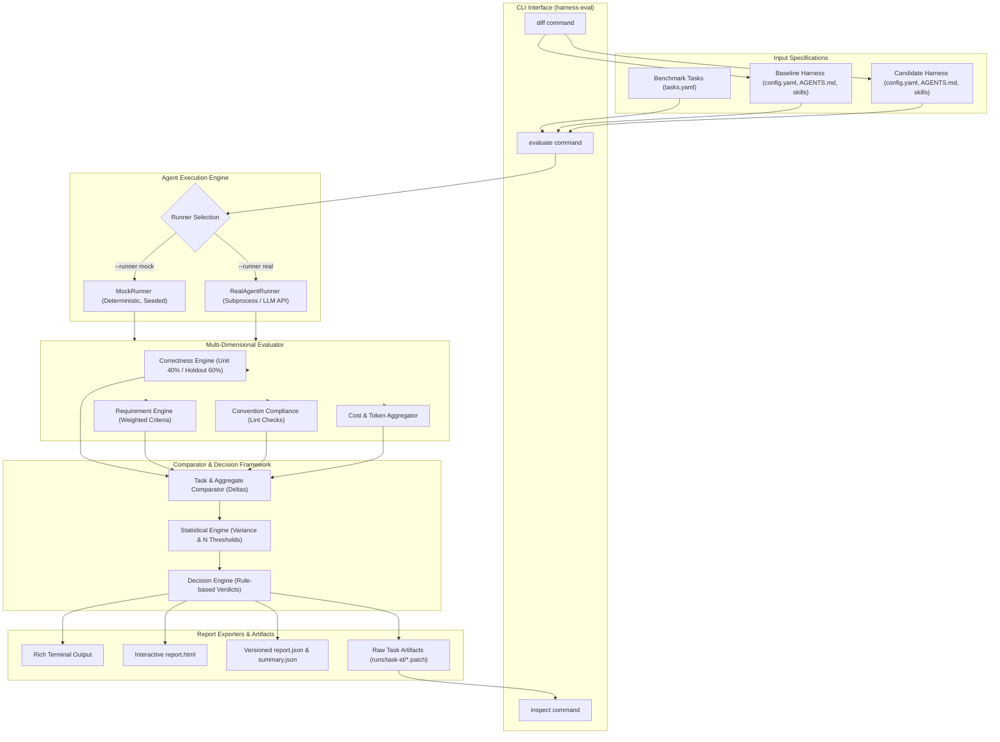

# Harness-Eval — Coding Agent Harness Comparison & Evaluation Engine

[](https://www.python.org/)
[]()
[]()
[]()
[]()

> **"Did changing the coding-agent harness make the agent better, worse, or inconclusive?"**

`harness-eval` is an empirical evaluation and comparison engine designed specifically for coding-agent harnesses. When engineering teams modify an LLM agent's operational perimeter—updating system prompts, modifying `AGENTS.md` instructions, adding skill libraries, altering tool permissions, or switching underlying foundation models—`harness-eval` provides transparent, auditable evidence and defensive verdicts (`POSITIVE`, `NEGATIVE`, or `INCONCLUSIVE`).

Rather than relying on subjective inspections of a few anecdotal outputs or collapsing multidimensional performance into an uninterpretable composite score, `harness-eval` executes baseline and candidate harness configurations over identical benchmark tasks under controlled, reproducible conditions.

---

> [!NOTE]
> **Complete Technical Specification**: For the exhaustive 24-section architecture reference, mathematical scoring formulas, decision engine rules matrix, and client-facing breakdown, see [`docs/Project_Documentation.md`](file:///d:/Task/chat/docs/Project_Documentation.md).

---

## 1. Key Value Propositions

- **Side-by-Side Controlled Evaluation**: Executes baseline and candidate harnesses against identical benchmark tasks with zero state contamination.
- **Holdout Test Verification**: Combines visible unit tests with hidden holdout verification suites (`eval_tests/`), penalizing agents that overfit to visible assertions (40% unit / 60% holdout split).
- **Multi-Dimensional Metrics**: Preserves distinct signals for Correctness, Requirement Satisfaction, Convention Compliance, Financial Cost, Execution Runtime, and Reliability rather than collapsing them into an arbitrary composite score.
- **Defensive Decision Framework**: Enforces a strict zero-regression policy, cost-inflation thresholds (>60%), and small-sample guardrails ($N < 10$), treating `INCONCLUSIVE` as a first-class, defensible outcome.
- **Pluggable Runner Architecture**: Ships with an offline, deterministic, MD5-seeded `MockRunner` (zero external API keys required) alongside a subprocess `RealAgentRunner` for live CLI/API integration.
- **Multi-Iteration Variance Analysis**: Supports repeated trials (`--repetitions`) to measure agent consistency, runtime medians, and cost distributions.
- **Rich Auditable Artifacts**: Produces ASCII-safe terminal tables, self-contained single-file dark-mode HTML reports, versioned JSON dumps (`SCHEMA_VERSION = "1.0.0"`), and per-task unified git patches (`.patch`).

---

## 2. High-Level Architecture



---

## 3. Repository & Folder Structure

```text
harness-eval/
├── AGENTS.md                     # Agent guidance & critical system invariants
├── DESIGN.md                     # Architectural rationale & trade-off documentation
├── README.md                     # Main GitHub repository overview & quick start
├── pyproject.toml                # Build configuration & dependencies
│
├── benchmarks/                   # Benchmark task suites & YAML definitions
│   ├── README.md                 # Benchmark guide & task specification schema
│   └── sample/
│       └── tasks.yaml            # Standard 6-task benchmark suite (task-01 to task-06)
│
├── harnesses/                    # Harness configurations under evaluation
│   ├── README.md                 # Harness architecture, config schema & diffing guide
│   ├── baseline/                 # Reference baseline harness (Haiku, basic skills)
│   │   ├── config.yaml
│   │   ├── AGENTS.md
│   │   └── skills/
│   └── candidate/                # Candidate harness (Sonnet, typing, testing, hooks)
│       ├── config.yaml
│       ├── AGENTS.md
│       ├── skills/
│       └── hooks/
│
├── sample_project/               # Target Python application under evaluation
│   ├── README.md                 # Target service architecture & holdout isolation guide
│   ├── app/                      # Source code (users.py, orders.py, database.py, auth.py)
│   ├── tests/                    # Visible unit tests
│   └── eval_tests/               # Hidden holdout verification tests
│
├── src/                          # Core harness-eval Python package
│   ├── README.md                 # Source architecture & module responsibilities
│   └── harness_eval/
│       ├── __init__.py
│       ├── __main__.py           # python -m harness_eval entrypoint
│       ├── cli.py                # CLI dispatcher (evaluate, inspect, diff)
│       ├── config.py             # DecisionPolicy thresholds
│       ├── models.py             # Versioned Pydantic schemas (SCHEMA_VERSION = "1.0.0")
│       ├── benchmarks/loader.py  # YAML task loader & filter
│       ├── harness/              # Config loaders & structural diff engine
│       ├── runners/              # Abstract, Mock, and Real runners
│       ├── evaluation/           # Dimensions, comparator, statistics, decision engine
│       └── reporting/            # Rich terminal, JSON, and standalone HTML exporters
│
├── tests/                        # Automated test suite (28 tests)
│   ├── README.md                 # Test suite guide, coverage matrix & invariants
│   ├── test_benchmark_loader.py
│   ├── test_comparator.py
│   ├── test_decision_logic.py
│   ├── test_e2e_cli.py
│   ├── test_evaluation_dimensions.py
│   ├── test_harness_diff.py
│   ├── test_harness_loader.py
│   ├── test_reporting.py
│   └── test_runners.py
│
├── reports/                      # Evaluation output artifacts
│   ├── README.md                 # Report artifact guide & inspection workflow
│   └── sample/                   # Generated evaluation run
│       ├── report.html           # Standalone interactive dark-mode HTML report
│       ├── report.json           # Full versioned JSON schema dump
│       ├── summary.json          # Compact CI/CD executive summary
│       └── runs/                 # Per-task raw diffs, logs & evidence
│
├── agent-process/                # Development audit trail & session logs
│   ├── README.md                 # Engineering phases & process documentation
│   ├── prompts/                  # Prompt progression (01_architecture, 02_impl, 03_review)
│   └── transcript/               # Complete build session execution transcript
│
└── docs/                         # In-depth technical specifications
    ├── README.md                 # Documentation index & navigation
    └── Project_Documentation.md  # Master 24-section technical architecture reference
```

---

## 4. Installation

### Prerequisites
- Python 3.10 or higher
- `pip` package manager

```bash
# Clone the repository
git clone https://github.com/example/harness-eval.git
cd harness-eval

# Create and activate virtual environment
python -m venv .venv

# On Linux/macOS:
source .venv/bin/activate

# On Windows (PowerShell):
.venv\Scripts\activate

# Install in editable mode with development dependencies
pip install -e .
```

---

## 5. Quick Start & CLI Usage

The `harness-eval` tool provides three primary CLI subcommands: `evaluate`, `inspect`, and `diff`.

### 1. Run Benchmark Evaluation (`evaluate`)
Compare the baseline harness against the candidate harness across all benchmark tasks:

```bash
harness-eval evaluate \
  --baseline harnesses/baseline \
  --candidate harnesses/candidate \
  --tasks benchmarks/sample/tasks.yaml \
  --output reports/sample
```

#### Key Options
| Flag | Default | Description |
| :--- | :--- | :--- |
| `--baseline` | `harnesses/baseline` | Directory containing baseline `config.yaml` |
| `--candidate` | `harnesses/candidate` | Directory containing candidate `config.yaml` |
| `--tasks` | `benchmarks/sample/tasks.yaml` | Path to benchmark tasks YAML suite |
| `--output` | `reports/sample` | Destination directory for generated artifacts |
| `--task` | `None` | Filter evaluation to a single task ID (e.g., `--task task-01`) |
| `--runner` | `mock` | Execution engine: `mock` (deterministic) or `real` (subprocess) |
| `--repetitions`| `1` | Repetitions per task for variance estimation |
| `--seed` | `42` | Random seed for deterministic mock execution |
| `--format` | `all` | Output format: `all`, `terminal`, `html`, or `json` |

### 2. Inspect Raw Task Evidence (`inspect`)
Audit task-level patch diffs, test logs, and criterion scores from a completed run:

```bash
harness-eval inspect task-01 --output reports/sample
```

### 3. Compare Harness Configurations (`diff`)
Inspect configuration differences (models, skills, tools, hooks, prompts) without running tasks:

```bash
harness-eval diff \
  --baseline harnesses/baseline \
  --candidate harnesses/candidate
```

---

## 6. Sample Evaluation Showcase

Running `harness-eval evaluate` on the sample project benchmark produces the following ASCII-safe terminal output:

```text
-------------------------- HARNESS EVALUATION REPORT --------------------------
+------------------------------ Harness Changes ------------------------------+
| Baseline : baseline (claude-3-5-haiku-20241022)                             |
| Candidate: candidate (claude-3-5-sonnet-20241022)                           |
| Skills Added  : skills/python-testing.md, skills/strict-typing.md           |
| Skills Removed: skills/basic-python.md                                      |
| Hooks Added   : hooks/pre_commit_lint.sh                                    |
+-----------------------------------------------------------------------------+
                 Evaluation Overview (6 Tasks, Repetitions=1)                  
+-----------------------------------------------------------------------------+
| Evaluation Dimension    |   Baseline |   Candidate |      Delta |  Relative |
|-------------------------+------------+-------------+------------+-----------|
| Correctness Rate        |      36.7% |      100.0% |    +63.3pp |   +172.7% |
| Requirement             |      31.4% |      100.0% |    +68.6pp |   +218.2% |
| Satisfaction            |            |             |            |           |
| Convention Compliance   |      75.0% |      100.0% |    +25.0pp |    +33.3% |
| Pass Rate               |       0.0% |      100.0% |   +100.0pp |         - |
| Average Cost ($)        |    $0.0091 |     $0.0328 |   $+0.0237 |   +260.4% |
| Average Runtime (s)     |      16.0s |       20.8s |      +4.7s |    +29.6% |
| Total Tokens            |      27784 |       36799 |      +9015 |    +32.5% |
+-----------------------------------------------------------------------------+
                          Per-Task Evidence Breakdown                          
+-----------------------------------------------------------------------------+
| Task ID | Title          | Baseline | Candidate |   Outcome    | Cost Delta |
|---------+----------------+----------+-----------+--------------+------------|
| task-01 | Add pagination |  FAILED  |  SUCCESS  | IMPROVED (+) |   $+0.0246 |
|         | to users API   |          |           |              |            |
| task-02 | Fix order      |  FAILED  |  SUCCESS  | IMPROVED (+) |   $+0.0248 |
|         | total bug      |          |           |              |            |
| task-03 | Add duplicate  |  FAILED  |  SUCCESS  | IMPROVED (+) |   $+0.0210 |
|         | email check    |          |           |              |            |
| task-04 | Add auth unit  |  FAILED  |  SUCCESS  | IMPROVED (+) |   $+0.0243 |
|         | tests          |          |           |              |            |
| task-05 | Refactor db    |  FAILED  |  SUCCESS  | IMPROVED (+) |   $+0.0232 |
|         | transaction    |          |           |              |            |
| task-06 | Add phone field|  FAILED  |  SUCCESS  | IMPROVED (+) |   $+0.0248 |
+-----------------------------------------------------------------------------+
+--------------------------- Evaluator Conclusion ----------------------------+
| DECISION: INCONCLUSIVE                                                      |
|                                                                             |
| Verdict: Promising correctness gain, but inconclusive due to resource       |
| trade-offs or sample size.                                                  |
| Reason: Candidate improved correctness by +63.3 percentage points (36.7% -> |
| 100.0%) and had 0 regressions. However, the verdict is INCONCLUSIVE due to  |
| higher operational cost (+260.4%), and limited sample size (N=6).           |
| Engineering teams should verify whether the accuracy gain justifies the     |
| added resource cost.                                                        |
|                                                                             |
| Documented Trade-offs / Limitations:                                        |
|  - Cost increased by +260.4% ($0.0091 -> $0.0328/task).                     |
|  - Sample size (N=6) is below threshold of 10 tasks for statistical         |
| certainty.                                                                  |
+-----------------------------------------------------------------------------+
```

---

## 7. Multi-Dimensional Evaluation Methodology

`harness-eval` scores agent performance across six distinct operational dimensions:

### 1. Correctness Rate (40/60 Split)
$$\text{Correctness Score} = \begin{cases} (U \times 0.40) + (H \times 0.60) & \text{if } H_{\text{total}} > 0 \\ U & \text{if } H_{\text{total}} = 0 \end{cases}$$
- $U$: Visible unit test pass rate in `tests/`.
- $H$: Private holdout test pass rate in `eval_tests/`.

### 2. Requirement Satisfaction
$$\text{Requirement Score} = \frac{\sum_{i=1}^n \text{Score}_i}{\sum_{i=1}^n \text{MaxScore}_i}$$
Evaluated against explicit acceptance criteria with individual weights defined in `tasks.yaml`.

### 3. Convention Compliance
$$\text{Convention Score} = \max\left(0.0, 1.0 - (\text{violations} \times 0.25)\right)$$
Penalizes missing required type hints or forbidden AST code patterns (e.g., bare `pass`, leftover `TODO`).

### 4. Financial Cost & Token Efficiency
$$\text{Cost} = \left(\frac{\text{Tokens}_{\text{in}}}{1000} \times \text{Price}_{\text{in}}\right) + \left(\frac{\text{Tokens}_{\text{out}}}{1000} \times \text{Price}_{\text{out}}\right)$$

### 5. Execution Runtime
Wall-clock latency recorded in seconds per task run.

### 6. Reliability & Pass Rate
Binary run status categorization: `SUCCESS`, `FAILED`, `TIMEOUT`, or `ERROR`.

---

## 8. Decision Engine Rules Matrix

The decision engine evaluates aggregated metrics and task deltas against explicit policy rules defined in [`DecisionPolicy`](file:///d:/Task/chat/src/harness_eval/config.py):

| Rule Identifier | Trigger Condition | Rationale & Outcome |
| :--- | :--- | :--- |
| `RULE_CORRECTNESS_DEGRADATION` | `correctness_delta < -0.02` | `NEGATIVE`: Candidate degraded overall correctness by >2pp. |
| `RULE_REGRESSION_DETECTED` | `regressions > 0` and `correctness_delta <= 0` | `NEGATIVE`: Candidate introduced regressions with no net correctness gain. |
| `RULE_UNRESOLVED_REGRESSION_RISK` | `regressions > 0` and `correctness_delta > 0` | `INCONCLUSIVE`: Accuracy improved on some tasks, but introduced regressions on others. |
| `RULE_HIGH_COST_INCREASE` | `cost_increase_pct > 60.0%` | Flags cost trade-off. Forces `INCONCLUSIVE` verdict even if correctness gained. |
| `RULE_SMALL_SAMPLE_SIZE` | `sample_size < 10` | Flags sample size uncertainty ($N < 10$). Directional only. |
| `RULE_INCONCLUSIVE_DUE_TO_TRADEOFFS` | `correctness_delta >= 0.08` with cost or small sample flag | `INCONCLUSIVE`: Strong accuracy gain achieved, but resource trade-offs or sample size require human vetting. |
| `RULE_CLEAR_POSITIVE` | `correctness_delta >= 0.08`, zero regressions, acceptable cost, $N \ge 10$ | `POSITIVE`: Unambiguous, cost-effective improvement across tasks. |
| `RULE_NEGLIGIBLE_DIFFERENCE` | `|correctness_delta| < 0.08` | `INCONCLUSIVE`: Negligible performance delta between harnesses. |

---

## 9. Real vs. Mock Runner

| Feature | Mock Runner (`--runner mock`, default) | Real Agent Runner (`--runner real`) |
| :--- | :--- | :--- |
| **Dependencies** | None (Zero external API keys or network) | Subprocess CLI (`AGENT_RUNNER_CMD`) or LLM API keys |
| **Determinism** | Fully deterministic via MD5 hashing & `--seed` | Non-deterministic (evaluates live LLM responses) |
| **Speed** | Instantaneous (<1 second for full suite) | Dependent on LLM generation & tool latency |
| **Best Used For**| CI/CD testing, test suite validation, local demo | Production harness benchmarking & agent tuning |

---

## 10. Automated Testing

The repository includes a comprehensive 28-test test suite in `tests/`:

```bash
# Run all tests
pytest -v tests
```

Output:
```text
tests/test_benchmark_loader.py::test_load_sample_benchmark PASSED        [  3%]
tests/test_benchmark_loader.py::test_load_benchmark_with_filter PASSED   [  7%]
tests/test_comparator.py::test_compare_task_outcome_improved PASSED      [ 17%]
tests/test_decision_logic.py::test_decision_positive PASSED              [ 32%]
tests/test_decision_logic.py::test_decision_inconclusive_due_to_cost_tradeoff PASSED [ 35%]
tests/test_e2e_cli.py::test_cli_diff_command PASSED                      [ 50%]
tests/test_evaluation_dimensions.py::test_correctness_with_holdout PASSED [ 60%]
tests/test_harness_diff.py::test_harness_diff_detection PASSED           [ 78%]
tests/test_reporting.py::test_export_reports PASSED                      [ 92%]
tests/test_runners.py::test_mock_runner_deterministic_run PASSED         [ 96%]
============================= 28 passed in 3.74s ==============================
```

For more details on test structure and coverage, see [`tests/README.md`](file:///d:/Task/chat/tests/README.md).

---

## 11. Security & Sandboxing

- **Subprocess Isolation**: When running `--runner real`, commands are executed in a subprocess. For evaluating untrusted LLM outputs, run `harness-eval` inside an isolated Docker container or ephemeral microVM.
- **Holdout Test Isolation**: Holdout test files (`eval_tests/`) must remain inaccessible to the candidate harness prompt during code generation.
- **Credential Safety**: Sensitive environment variables (`ANTHROPIC_API_KEY`, `OPENAI_API_KEY`) are read strictly from the process environment and are never written to report artifacts or logs.

---

## 12. Documentation Index

- [`docs/Project_Documentation.md`](file:///d:/Task/chat/docs/Project_Documentation.md) — Master Technical Architecture Reference & Specification (24 sections)
- [`DESIGN.md`](file:///d:/Task/chat/DESIGN.md) — Core design decisions, hardest trade-offs, and cut scope
- [`AGENTS.md`](file:///d:/Task/chat/AGENTS.md) — Coding agent rules & system invariants
- [`benchmarks/README.md`](file:///d:/Task/chat/benchmarks/README.md) — Benchmark task specifications & schema guide
- [`harnesses/README.md`](file:///d:/Task/chat/harnesses/README.md) — Agent harness configurations & diffing guide
- [`sample_project/README.md`](file:///d:/Task/chat/sample_project/README.md) — Sample application architecture & holdout tests
- [`src/README.md`](file:///d:/Task/chat/src/README.md) — Source code architecture & extension points
- [`tests/README.md`](file:///d:/Task/chat/tests/README.md) — Automated test suite & invariants
- [`reports/README.md`](file:///d:/Task/chat/reports/README.md) — Evaluation reports, HTML/JSON artifacts & inspection
- [`agent-process/README.md`](file:///d:/Task/chat/agent-process/README.md) — Engineering audit trail & prompt logs

---

## 13. License

Distributed under the MIT License. See `LICENSE` for details.# Harness_by_taha

