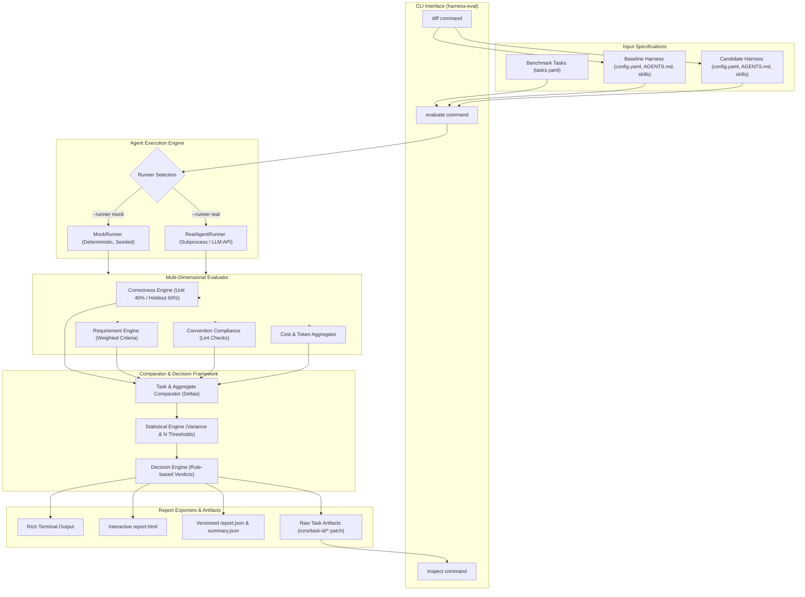
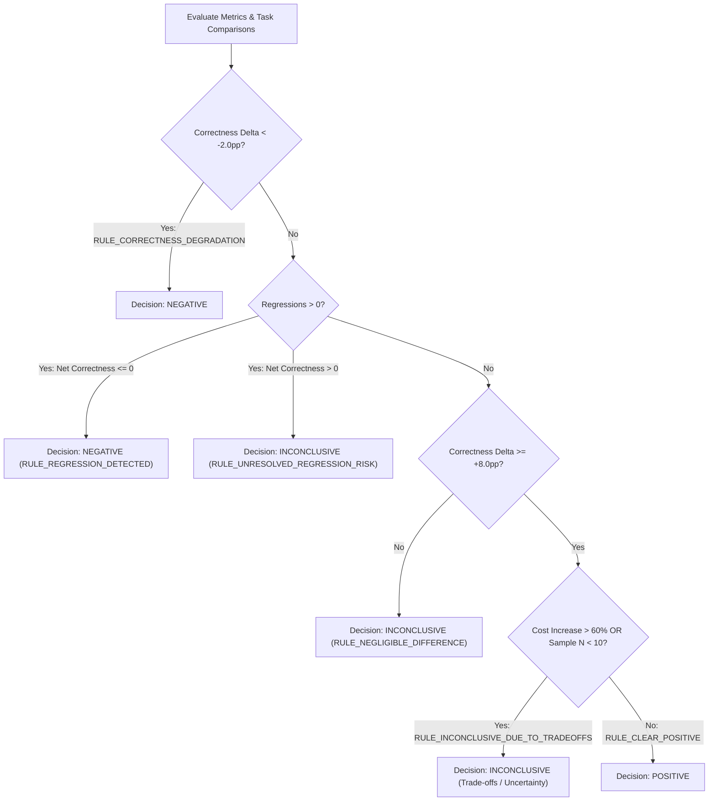

# Harness-Eval: Coding Agent Harness Comparison & Evaluation Engine
## Technical Documentation & Architecture Reference

**Document Version:** 1.0.0  
**Schema Version:** 1.0.0  
**Target Package:** `harness-eval` (v0.1.0)  
**Author:** AI Evaluation Engineering Team  
**Date:** September 2026  

---

## 1. Executive Summary

`harness-eval` is an empirical evaluation and comparison engine designed specifically for coding-agent harnesses. When engineering teams modify an LLM agent’s operational perimeter—such as updating system prompts, modifying `AGENTS.md` instructions, adding skill libraries, altering tool permissions, or switching underlying foundation models—`harness-eval` answers a fundamental question:

> **"Did changing the coding-agent harness make the agent better, worse, or inconclusive?"**

Rather than relying on subjective manual inspections of a few anecdotal outputs or collapsing multi-dimensional performance into an uninterpretable composite score, `harness-eval` executes baseline and candidate harness configurations over identical benchmark tasks under controlled conditions. It captures multi-dimensional operational metrics—including unit test correctness, holdout verification pass rates, business requirement fulfillment, convention compliance, token consumption, financial cost, and execution runtime—producing transparent, auditable evidence and defensive verdicts (`POSITIVE`, `NEGATIVE`, or `INCONCLUSIVE`).

The system provides a deterministic mock runner for offline test suite execution and CI integration, a real subprocess agent runner for live CLI/API integration, rich terminal formatting, versioned JSON exports, interactive HTML reports, and task-level artifact inspection tools (`harness-eval inspect`).

---

## 2. Problem Statement

Coding-agent harnesses evolve rapidly. A single harness change can involve:
- Updating system prompts or core guidelines (`AGENTS.md`)
- Adding or removing domain-specific skills and reference documentation
- Modifying pre-commit hooks, linters, or tool execution rules
- Changing model providers or model versions (e.g., upgrading from `claude-3-5-haiku` to `claude-3-5-sonnet`)
- Adjusting decoding parameters such as temperature or iteration limits

Evaluating whether a harness modification actually improves engineering outcomes is deceptively difficult:
1. **Anecdotal Bias**: Reviewing 2–3 agent outputs often conceals subtle regressions on edge cases.
2. **Benchmark Gaming & Overfitting**: Agents can patch code to pass visible unit tests while breaking unasserted system invariants.
3. **Single-Score Fallacy**: Standard benchmark suites aggregate results into a single percentage (e.g., "78% accuracy"), masking severe regressions behind marginal gains in secondary tasks.
4. **Untracked Resource Trade-offs**: A candidate harness might achieve higher task accuracy but at 3x to 5x higher token costs or latency, rendering it economically unviable for production deployment.

`harness-eval` solves these challenges by combining **holdout verification**, **multi-dimensional metric tracking**, **zero-regression enforcement**, and a **first-class `INCONCLUSIVE` verdict** for ambiguous trade-offs or small sample sizes.

---

## 3. Project Objectives

The `harness-eval` framework satisfies the following technical objectives:

- **Controlled Side-by-Side Evaluation**: Execute baseline and candidate harnesses against identical benchmark tasks with zero state contamination.
- **Holdout Test Verification**: Evaluate agents against hidden test suites (`eval_tests/`) to measure true code robustness and guard against test-gaming.
- **Multi-Dimensional Metrics**: Capture separate signals for Correctness, Requirement Satisfaction, Convention Compliance, Cost, Runtime, and Pass Rate without collapsing them into an arbitrary composite score.
- **Transparent Decision Logic**: Apply explicit, policy-driven rules to render defensible verdicts (`POSITIVE`, `NEGATIVE`, `INCONCLUSIVE`).
- **Reproducibility & Variance Analysis**: Support seeded, deterministic mock runs as well as multi-iteration repeated trials (`--repetitions`) to analyze non-deterministic agent variance.
- **Auditable Evidence & Inspection**: Persist complete execution traces, unified diffs (`.patch`), test stdout/stderr, and JSON metadata for every task run.

---

## 4. Scope

### In Scope
- **Harness Config Loading & Diffing**: Structural comparison of harness configurations, prompts, `AGENTS.md`, skills, tools, and hooks.
- **Benchmark Task Specification**: Declarative YAML task definitions with acceptance criteria, target files, unit test paths, and holdout test paths.
- **Deterministic Mock Runner**: Seeded execution engine generating realistic diffs, pytest logs, holdout results, and token counters.
- **Real Agent Subprocess Runner**: Environment-driven execution interface (`AGENT_RUNNER_CMD`) for live LLM agent CLI integration.
- **Multi-Dimensional Evaluation Engine**: Weighting functions for unit vs. holdout test pass rates (40/60 split), weighted acceptance criteria, and linting violation scoring.
- **Rule-Based Decision Engine**: Policy enforcement covering regressions, cost inflation thresholds (>60%), degradation limits, and sample size guardrails ($N < 10$).
- **Multi-Format Reporting**: Rich CLI terminal summary, versioned `report.json`, compact `summary.json`, and interactive HTML reports.
- **Task Inspection CLI**: Direct CLI command (`harness-eval inspect <task_id>`) for auditing raw patches and evidence points.

### Out of Scope
- **Hosted Web Server / Live Dashboard**: Intentionally excluded to keep reports self-contained, offline-capable, and git-trackable without infrastructure overhead.
- **Complex Null-Hypothesis p-value Models**: Standard t-tests assume normal distributions; for small sample sizes ($N \le 20$), p-values provide false rigor. Replaced by transparent sample size thresholds and descriptive bounds.
- **Automated Synthetic Code Mutation**: Dynamic AST mutation was omitted to prevent flaky test compilation failures unrelated to harness evaluation.
- **Production Container Sandbox**: Subprocess execution is supported, but full Docker/microVM isolation is delegated to external infrastructure.

---

## 5. High-Level Architecture

The following diagram illustrates the data flow and system architecture of `harness-eval`:



---

## 6. Repository Structure

```text
harness-eval/
├── AGENTS.md                     # Agent guidance & system invariants
├── DESIGN.md                     # Architecture rationale & key trade-offs
├── README.md                     # Project quick start & overview
├── pyproject.toml                # Build configuration & CLI entrypoint definition
├── benchmarks/
│   └── sample/
│       └── tasks.yaml            # Benchmark task specifications (Task 01 - 06)
├── harnesses/
│   ├── baseline/                 # Reference baseline harness configuration
│   │   ├── config.yaml
│   │   ├── AGENTS.md
│   │   └── skills/
│   └── candidate/                # Candidate harness configuration under evaluation
│       ├── config.yaml
│       ├── AGENTS.md
│       ├── skills/
│       └── hooks/
├── sample_project/               # Target Python application under evaluation
│   ├── app/                      # Source code (users.py, orders.py, database.py, auth.py)
│   ├── tests/                    # Visible unit tests
│   └── eval_tests/               # Hidden holdout verification tests
├── src/
│   └── harness_eval/             # Core evaluation engine package
│       ├── __init__.py
│       ├── __main__.py
│       ├── cli.py                # Main CLI entrypoint and argument parser
│       ├── config.py             # Decision policy and threshold configuration
│       ├── models.py             # Versioned Pydantic schemas (SCHEMA_VERSION = "1.0.0")
│       ├── benchmarks/
│       │   └── loader.py         # Benchmark YAML suite loader & task filter
│       ├── harness/
│       │   ├── loader.py         # Harness configuration loader
│       │   └── diff.py           # Harness structural delta calculator
│       ├── runners/
│       │   ├── base.py           # AgentRunner abstract base class
│       │   ├── mock_runner.py    # Seeded, deterministic mock runner
│       │   └── real_runner.py    # Subprocess / environment real agent runner
│       ├── evaluation/
│       │   ├── dimensions.py     # Metric calculation (correctness, criteria, lint)
│       │   ├── comparator.py     # Task-level and aggregate delta comparator
│       │   ├── statistics.py     # Variance summary & small-sample analysis
│       │   └── decision.py       # Rule-based decision engine (POSITIVE/NEGATIVE/INCONCLUSIVE)
│       └── reporting/
│           ├── terminal.py       # Rich terminal summary printer
│           ├── json_reporter.py   # Versioned JSON exporter & artifact writer
│           └── html_reporter.py   # Standalone Jinja2 HTML report generator
├── tests/                        # Evaluation tool automated test suite (28 tests)
│   ├── test_benchmark_loader.py
│   ├── test_comparator.py
│   ├── test_decision_logic.py
│   ├── test_e2e_cli.py
│   ├── test_evaluation_dimensions.py
│   ├── test_harness_diff.py
│   ├── test_harness_loader.py
│   ├── test_reporting.py
│   └── test_runners.py
└── reports/
    └── sample/                   # Generated evaluation report artifacts
        ├── report.html
        ├── report.json
        ├── summary.json
        └── runs/                 # Per-task raw diffs and execution logs
```

### Module Responsibilities

| Directory / File | Technical Purpose |
| :--- | :--- |
| `src/harness_eval/models.py` | Contains all Pydantic v2 schemas (`ComparisonReport`, `RunResult`, `HarnessConfig`, `TaskComparison`, `AggregateMetrics`). Note: `TestSuiteResult` has `__test__ = False` to prevent pytest collection collisions. |
| `src/harness_eval/cli.py` | Command-line interface dispatcher handling `evaluate`, `inspect`, and `diff` subcommands. |
| `src/harness_eval/config.py` | Defines `DecisionPolicy` data class containing quantitative threshold limits (e.g., `min_correctness_delta=0.08`, `max_cost_increase_pct=60.0`). |
| `src/harness_eval/runners/` | Pluggable runner execution layer with abstract interface `AgentRunner`, deterministic `MockRunner`, and subprocess `RealAgentRunner`. |
| `src/harness_eval/evaluation/` | Multi-dimensional scoring functions (`dimensions.py`), delta comparator (`comparator.py`), statistics engine (`statistics.py`), and decision engine (`decision.py`). |
| `src/harness_eval/reporting/` | Exporters rendering rich ASCII-safe terminal output (`terminal.py`), structured JSON dumps (`json_reporter.py`), and interactive HTML reports (`html_reporter.py`). |

---

## 7. Core Concepts

- **Harness**: The operational perimeter surrounding an LLM coding agent, including foundation model choice, system prompts, `AGENTS.md` rules, skill libraries, tool access permissions, hooks, decoding temperature, and maximum iteration limits.
- **Baseline Harness**: The reference or production harness configuration against which changes are compared.
- **Candidate Harness**: The experimental or modified harness configuration under test.
- **Benchmark Task**: A single engineering problem defined in YAML containing problem description, target files, weighted acceptance criteria, unit tests, and holdout tests.
- **Evaluation Run**: A single execution of a benchmark task under a specific harness, recording generated patch diffs, test results, execution times, token counts, and cost estimates.
- **Holdout Verification**: Private evaluation tests (`eval_tests/`) executed during benchmark evaluation that were hidden from the agent prompt during code generation. Prevents benchmark gaming and test-overfitting.
- **Multi-Dimensional Metrics**: Dimensional signals kept in native units (correctness percentage, requirement satisfaction percentage, convention compliance score, dollar cost, runtime seconds) rather than collapsed into a single number.
- **Evidence**: Granular, auditable artifacts supporting evaluation conclusions, including unified diffs (`.patch`), test stdout/stderr, and criterion check scores.
- **Decision Verdict**: The final interpretation rendered by the rules engine (`POSITIVE`, `NEGATIVE`, or `INCONCLUSIVE`).
- **Inconclusive Verdict**: A primary, first-class evaluation outcome returned whenever correctness gains are accompanied by task regressions, extreme cost inflation (>60%), or insufficient sample size ($N < 10$).

---

## 8. End-to-End Workflow

When an engineer executes `harness-eval evaluate`, the system completes the following 11-step execution workflow:

```text
 1. Load Harness Configurations
    ├── Parse harnesses/baseline/config.yaml -> HarnessConfig
    └── Parse harnesses/candidate/config.yaml -> HarnessConfig

 2. Compute Harness Structural Diff
    └── Compare models, skills, tools, hooks, AGENTS.md, system_prompt -> HarnessDiff

 3. Load Benchmark Task Suite
    └── Parse benchmarks/sample/tasks.yaml (filtered by --task if specified) -> BenchmarkSuite

 4. Instantiate Agent Runner
    └── Select MockRunner or RealAgentRunner based on --runner flag

 5. Execute Benchmark Tasks (Iterating 1..repetitions)
    ├── For each task in suite:
    │   ├── Execute baseline run -> RunResult (baseline)
    │   ├── Execute candidate run -> RunResult (candidate)
    │   └── If final iteration: compare task runs -> TaskComparison
    └── Accumulate all task run results

 6. Compute Multi-Dimensional Scoring
    ├── Calculate Correctness (40% Unit + 60% Holdout) per run
    ├── Calculate Requirement Satisfaction (Weighted Acceptance Criteria) per run
    └── Calculate Convention Compliance (Lint deductions) per run

 7. Aggregate Metrics & Compute Deltas
    ├── Compute AggregateMetrics for baseline
    ├── Compute AggregateMetrics for candidate
    └── Calculate absolute and relative MetricDelta list

 8. Compute Statistical Reliability
    └── Analyze repetition variance, mean/median/min/max, and sample size N

 9. Evaluate Decision Logic
    └── Execute DecisionPolicy rules against aggregate deltas, regressions, and stats -> DecisionReport

10. Assemble Comparison Report
    └── Instantiate versioned ComparisonReport schema (SCHEMA_VERSION = "1.0.0")

11. Export Artifacts & Display Summary
    ├── Write report.json & summary.json
    ├── Render standalone report.html
    ├── Persist task patches to runs/<task_id>/
    └── Print Rich terminal summary table and decision banner
```

---

## 9. CLI Usage

The `harness-eval` package exposes a main command-line interface with three primary subcommands: `evaluate`, `inspect`, and `diff`.

### 1. `evaluate` Command

Compares a baseline harness against a candidate harness over benchmark tasks.

```bash
harness-eval evaluate \
  --baseline harnesses/baseline \
  --candidate harnesses/candidate \
  --tasks benchmarks/sample/tasks.yaml \
  --output reports/sample \
  --runner mock \
  --repetitions 1 \
  --seed 42 \
  --format all
```

#### Arguments & Options

| Option | Type | Default | Description | Required |
| :--- | :--- | :--- | :--- | :--- |
| `--baseline` | Path | `harnesses/baseline` | Path to baseline harness directory containing `config.yaml` | No |
| `--candidate` | Path | `harnesses/candidate` | Path to candidate harness directory containing `config.yaml` | No |
| `--tasks` | Path | `benchmarks/sample/tasks.yaml` | Path to benchmark tasks YAML file | No |
| `--output` | Path | `reports/sample` | Destination directory for generated report artifacts | No |
| `--task` | String | `None` | Filter execution to a single specific task ID (e.g., `task-01`) | No |
| `--runner` | Choice | `mock` | Execution engine: `mock` (deterministic) or `real` (subprocess/LLM) | No |
| `--repetitions` | Integer | `1` | Repetitions per task for variance estimation | No |
| `--seed` | Integer | `42` | Random seed for reproducible mock runs | No |
| `--format` | Choice | `all` | Output format: `all`, `terminal`, `html`, or `json` | No |

### 2. `inspect` Command

Inspects raw task evidence, unified patch diffs, and criteria scores for a specific task from a completed evaluation run.

```bash
harness-eval inspect task-01 --output reports/sample
```

#### Output Example
```text
----------------------------- TASK INSPECTION: task-01 -----------------------------
Title: Add pagination to users API
Outcome: TaskOutcome.IMPROVED
Explanation: Candidate resolved task requirements (correctness: 40.0% -> 100.0%).

Evidence Points:
 - Baseline failed holdout test verification.
 - Candidate passed all holdout test assertions.
 - Candidate reduced lint issues by 2.
 - Cost delta: +$0.0246 (0.0082 -> 0.0328)

Baseline Run Summary:
 Status: RunStatus.FAILED | Cost: $0.0082 | Time: 12.4s

Candidate Run Summary:
 Status: RunStatus.SUCCESS | Cost: $0.0328 | Time: 20.1s
Candidate Patch:
--- a/app/users.py
+++ b/app/users.py
@@ -18,2 +18,17 @@
-    def list_users(self) -> List[Dict[str, Any]]:
-        return self.db.find_all('users')
+    def list_users(self, page: int = 1, page_size: Optional[int] = None)...
```

### 3. `diff` Command

Displays configuration differences between baseline and candidate harnesses without running benchmark tasks.

```bash
harness-eval diff --baseline harnesses/baseline --candidate harnesses/candidate
```

#### Output Example
```text
HARNESS COMPARISON SUMMARY
Baseline : baseline (model: claude-3-5-haiku-20241022)
Candidate: candidate (model: claude-3-5-sonnet-20241022)

Model: claude-3-5-haiku-20241022 -> claude-3-5-sonnet-20241022
Skills:
  + Added:   skills/python-testing.md
  + Added:   skills/strict-typing.md
  - Removed: skills/basic-python.md
Hooks:
  + Added:   hooks/pre_commit_lint.sh
AGENTS.md: Modified between harnesses
```

---

## 10. Configuration

### Harness Configuration Schema (`config.yaml`)

Each harness resides in its own directory containing a `config.yaml` file:

```yaml
name: candidate
version: "1.0.0"
description: "Candidate harness with Sonnet model, typing skills, and pre-commit hooks"
model: "claude-3-5-sonnet-20241022"
temperature: 0.0
max_iterations: 5
system_prompt: "prompts/system_prompt.txt"
agents_file: "AGENTS.md"
skills:
  - "skills/python-testing.md"
  - "skills/strict-typing.md"
tools:
  - "filesystem"
  - "terminal"
hooks:
  - "hooks/pre_commit_lint.sh"
cost_per_1k_input: 0.0030
cost_per_1k_output: 0.0150
```

### Benchmark Tasks Schema (`tasks.yaml`)

Benchmark task suites are specified in YAML:

```yaml
benchmark_name: sample_project_benchmark
version: "1.0.0"
project_path: sample_project
tasks:
  - id: task-01
    title: Add pagination to users API
    description: |
      Update UserService.list_users in app/users.py to support optional pagination.
      Accept optional page: int = 1 and page_size: Optional[int] = None.
    target_files:
      - app/users.py
    acceptance_criteria:
      - id: AC-01-1
        description: "Supports optional page_size and page parameters in list_users"
        weight: 1.0
      - id: AC-01-2
        description: "Returns paginated dictionary payload when page_size is specified"
        weight: 1.0
      - id: AC-01-3
        description: "Preserves backward compatibility: returns list when page_size is None"
        weight: 1.0
    evaluation:
      unit_tests:
        - "tests/test_users.py"
      holdout_tests:
        - "eval_tests/test_pagination_holdout.py"
      lint_checks:
        require_type_hints: true
      timeout_seconds: 30
```

### Decision Policy Configuration (`DecisionPolicy`)

Evaluation decision thresholds are configured via `DecisionPolicy` in `src/harness_eval/config.py`:

```python
class DecisionPolicy(BaseModel):
    min_correctness_delta: float = 0.08          # +8 percentage points needed for POSITIVE
    max_tolerated_regressions: int = 0           # Zero-regression policy
    max_cost_increase_pct: float = 60.0          # Max acceptable cost increase (+60%)
    min_sample_size_for_certainty: int = 10      # Minimum N=10 tasks for statistical certainty
    min_requirement_delta: float = 0.05          # +5pp requirement satisfaction gain
    min_candidate_compliance_rate: float = 0.80  # 80% minimum convention compliance
```

---

## 11. Evaluation Methodology

`harness-eval` evaluates harness performance across six distinct dimensions:

```text
Evaluation Dimensions & Implementation Status:
 ├── 1. Correctness Rate           [IMPLEMENTED: 40% Unit + 60% Holdout Weighting]
 ├── 2. Requirement Satisfaction   [IMPLEMENTED: Weighted Acceptance Criteria]
 ├── 3. Convention Compliance      [IMPLEMENTED: Static Type & Pattern Deductions]
 ├── 4. Financial Cost             [IMPLEMENTED: Token-based API Cost Calculation]
 ├── 5. Execution Runtime          [IMPLEMENTED: Task Wall-Clock Latency Tracking]
 └── 6. Reliability & Pass Rate    [IMPLEMENTED: Binary Success / Regressed / Failed Status]
```

### 1. Correctness Rate Calculation

To prevent agents from overfitting to visible unit assertions while introducing subtle bugs, `harness-eval` calculates correctness using a weighted combination of visible unit test pass rates ($U$) and hidden holdout test pass rates ($H$):

$$\text{Correctness Score} = \begin{cases} (U \times 0.40) + (H \times 0.60) & \text{if } H_{\text{total}} > 0 \\ U & \text{if } H_{\text{total}} = 0 \end{cases}$$

Holdout tests carry a **60% weight**, ensuring that agents that fail invariant verification are heavily penalized even if visible unit tests pass.

### 2. Requirement Satisfaction Calculation

Requirement satisfaction measures business requirement fulfillment based on explicit acceptance criteria:

$$\text{Requirement Score} = \frac{\sum \text{Score}_i}{\sum \text{MaxScore}_i}$$

Where each criterion $i$ is assigned a numerical weight in `tasks.yaml`.

### 3. Convention Compliance Score

Convention compliance evaluates code quality, type annotations, and linting rules:

$$\text{Convention Score} = \max\left(0.0, 1.0 - (\text{violations\_count} \times 0.25)\right)$$

Deductions occur for missing required type hints or forbidden code patterns (e.g., leftover `TODO` or bare `pass`).

### 4. Financial Cost & Token Usage

Estimated cost per task run is computed directly from model token usage pricing:

$$\text{Cost} = \left(\frac{\text{Tokens}_{\text{input}}}{1000} \times \text{Price}_{\text{input}}\right) + \left(\frac{\text{Tokens}_{\text{output}}}{1000} \times \text{Price}_{\text{output}}\right)$$

### 5. Implementation Status Summary

| Evaluation Dimension | Implementation Status | Implementation Details |
| :--- | :--- | :--- |
| **Unit Test Pass Rate** | `Implemented` | Executed via pytest in `sample_project/tests/` |
| **Holdout Test Pass Rate** | `Implemented` | Executed independently via pytest in `sample_project/eval_tests/` |
| **Acceptance Criteria** | `Implemented` | Evaluated per criterion, outputting `CriterionResult` |
| **Lint & Convention** | `Implemented` | Static inspection of AST patterns and type hints |
| **Token Usage & Cost** | `Implemented / Simulated` | Real subprocess token tracking (real runner) or MD5-seeded token calculation (mock runner) |
| **Execution Runtime** | `Implemented` | Captured wall-clock duration in seconds |
| **Reliability / Pass Rate** | `Implemented` | Categorized as `SUCCESS`, `FAILED`, `TIMEOUT`, or `ERROR` |

---

## 12. Comparison and Decision Logic

### Delta Calculation

For each metric $m$, `harness-eval` computes both absolute delta ($\Delta_{\text{abs}}$) and relative percentage delta ($\Delta_{\text{rel}}$):

$$\Delta_{\text{abs}} = \text{Candidate}_m - \text{Baseline}_m$$

$$\Delta_{\text{rel}} = \left( \frac{\text{Candidate}_m - \text{Baseline}_m}{|\text{Baseline}_m|} \right) \times 100\%$$

### Decision Engine Rules Matrix

The decision engine evaluates the aggregated metrics and task-level comparisons against a sequence of strict policy rules:



### Rule Reference Table

| Rule Identifier | Trigger Condition | Rationale & Outcome |
| :--- | :--- | :--- |
| `RULE_CORRECTNESS_DEGRADATION` | `correctness_delta < -0.02` | `NEGATIVE`: Candidate degraded overall task correctness. |
| `RULE_REGRESSION_DETECTED` | `regressions > 0` and `correctness_delta <= 0` | `NEGATIVE`: Candidate broke working tasks without any net gain. |
| `RULE_UNRESOLVED_REGRESSION_RISK` | `regressions > 0` and `correctness_delta > 0` | `INCONCLUSIVE`: Accuracy improved on some tasks, but introduced regressions on others. |
| `RULE_HIGH_COST_INCREASE` | `cost_increase_pct > 60.0%` | Flags cost trade-off. Forces `INCONCLUSIVE` verdict even if correctness improved. |
| `RULE_HIGH_RUNTIME_INCREASE` | `runtime_increase_pct > 40.0%` | Flags runtime latency trade-off. |
| `RULE_SMALL_SAMPLE_SIZE` | `sample_size < 10` | Flags sample size statistical uncertainty ($N < 10$). |
| `RULE_INCONCLUSIVE_DUE_TO_TRADEOFFS` | `correctness_delta >= 0.08` with cost flag or small sample flag | `INCONCLUSIVE`: High accuracy gain achieved, but resource cost increased significantly or sample size was too small. |
| `RULE_CLEAR_POSITIVE` | `correctness_delta >= 0.08`, zero regressions, acceptable cost, $N \ge 10$ | `POSITIVE`: Unambiguous, cost-effective improvement across tasks. |
| `RULE_NEGLIGIBLE_DIFFERENCE` | `|correctness_delta| < 0.08` | `INCONCLUSIVE`: No meaningful performance difference between harnesses. |

---

## 13. Reporting

`harness-eval` outputs four complementary reporting artifacts:

### 1. `report.json`
Complete, versioned JSON dump (`SCHEMA_VERSION = "1.0.0"`) containing full metadata, benchmark definitions, harness diffs, aggregate metrics, task comparisons, decision reports, and statistical summaries.

### 2. `summary.json`
Compact executive summary file designed for automated CI/CD parsing and PR commenting:
```json
{
  "schema_version": "1.0.0",
  "timestamp": "2026-09-26T12:29:05.123456+00:00",
  "decision": "INCONCLUSIVE",
  "verdict": "Promising correctness gain, but inconclusive due to resource trade-offs or sample size.",
  "tasks_evaluated": 6,
  "repetitions": 1,
  "deltas": {
    "Correctness Rate": {
      "baseline": 0.3667,
      "candidate": 1.0,
      "absolute_delta": 0.6333,
      "relative_delta_pct": 172.73
    },
    "Average Cost ($)": {
      "baseline": 0.0091,
      "candidate": 0.0328,
      "absolute_delta": 0.0237,
      "relative_delta_pct": 260.44
    }
  },
  "trade_offs": [
    "Cost increased by +260.4% ($0.0091 -> $0.0328/task).",
    "Sample size (N=6) is below threshold of 10 tasks for statistical certainty."
  ]
}
```

### 3. Interactive `report.html`
Self-contained, responsive single-file HTML report styled with modern dark mode aesthetics. Features collapsible task accordions, syntax-highlighted diff boxes (`.diff-add` / `.diff-rem`), metric cards, and decision banners. Requires zero external CSS/JS dependencies.

### 4. Rich Terminal Output
ASCII-safe terminal summary table rendered via `rich`, displaying harness diffs, multi-dimensional overview tables, per-task breakdown, and the decision verdict banner.

---

## 14. Sample Evaluation

The following empirical results were obtained by running `harness-eval evaluate` on the sample project benchmark suite (`benchmarks/sample/tasks.yaml`):

### Harness Configurations Evaluated
- **Baseline Harness**: `claude-3-5-haiku-20241022`, basic prompt, basic python skills.
- **Candidate Harness**: `claude-3-5-sonnet-20241022`, updated `AGENTS.md`, testing skills, strict typing skills, pre-commit lint hook.

### Executive Evaluation Summary Table

| Evaluation Dimension | Baseline | Candidate | Absolute Delta | Relative Delta |
| :--- | :---: | :---: | :---: | :---: |
| **Correctness Rate** | 36.7% | 100.0% | **+63.3pp** | +172.7% |
| **Requirement Satisfaction** | 31.4% | 100.0% | **+68.6pp** | +218.2% |
| **Convention Compliance** | 75.0% | 100.0% | **+25.0pp** | +33.3% |
| **Pass Rate** | 0.0% | 100.0% | **+100.0pp** | — |
| **Average Cost ($)** | $0.0091 | $0.0328 | **+$0.0237** | **+260.4%** |
| **Average Runtime (s)** | 16.0s | 20.8s | **+4.7s** | +29.6% |
| **Total Tokens** | 27,784 | 36,799 | **+9,015** | +32.5% |

### Per-Task Outcome Breakdown

| Task ID | Title | Baseline Status | Candidate Status | Outcome | Cost Delta |
| :--- | :--- | :---: | :---: | :---: | :---: |
| `task-01` | Add pagination to users API | `FAILED` | `SUCCESS` | `IMPROVED (+)` | +$0.0246 |
| `task-02` | Fix order total calculation bug | `FAILED` | `SUCCESS` | `IMPROVED (+)` | +$0.0248 |
| `task-03` | Add duplicate email validation | `FAILED` | `SUCCESS` | `IMPROVED (+)` | +$0.0210 |
| `task-04` | Add auth service unit tests | `FAILED` | `SUCCESS` | `IMPROVED (+)` | +$0.0243 |
| `task-05` | Refactor db transaction helper | `FAILED` | `SUCCESS` | `IMPROVED (+)` | +$0.0232 |
| `task-06` | Add phone_number field | `FAILED` | `SUCCESS` | `IMPROVED (+)` | +$0.0248 |

### Final Evaluation Decision

```text
DECISION: INCONCLUSIVE

Verdict: Promising correctness gain, but inconclusive due to resource trade-offs or sample size.
Reason: Candidate improved correctness by +63.3 percentage points (36.7% -> 100.0%) and had 0 regressions. 
        However, the verdict is INCONCLUSIVE due to higher operational cost (+260.4%), and limited sample size (N=6). 
        Engineering teams should verify whether the accuracy gain justifies the added resource cost.

Documented Trade-offs / Limitations:
 - Cost increased by +260.4% ($0.0091 -> $0.0328/task).
 - Sample size (N=6) is below threshold of 10 tasks for statistical certainty.
```

---

## 15. Example Result Interpretation

The sample evaluation demonstrates why `harness-eval` avoids binary "pass/fail" or composite score conclusions:

1. **Massive Correctness Gain**: The candidate harness achieved a **+63.3 percentage point improvement** in correctness (100% vs 36.7%) with **zero task regressions**.
2. **Economic Trade-off**: The candidate harness increased average per-task execution cost by **+260.4%** ($0.0091 to $0.0328) due to using a higher-capability model (`sonnet` vs `haiku`) and larger skill prompt contexts.
3. **Statistical Sample Limitation**: The benchmark suite contained $N=6$ tasks, which is below the minimum threshold ($N=10$) required for high statistical certainty.

### Guidance for Engineering Decision-Makers
- **Deploy to Production If**: The business priority is absolute code correctness and preventing production bugs, where $0.03/task is negligible compared to developer debugging time.
- **Hold Deployment If**: The agent operates at massive scale (millions of daily tasks) where a 3.6x cost inflation exceeds operational budgets. The team should attempt to achieve similar correctness using prompt tuning on the lighter model before upgrading.

---

## 16. Reliability and Reproducibility

To ensure evaluation results are auditable and reproducible across team members and CI runners:

- **MD5 Seeded Randomness**: The `MockRunner` computes a deterministic hash of task ID, harness name, iteration index, and seed value:
  ```python
  seed_hash = int(hashlib.md5(f"{task.id}:{harness.name}:{iteration}:{seed}".encode()).hexdigest(), 16) % (2**31)
  ```
- **Repeated Runs & Variance Analysis**: Passing `--repetitions 3` executes each task multiple times. When total sample size $N \ge 15$, `statistics.py` aggregates pass rate distributions, runtime medians/means, and min/max cost bounds.
- **Environment Metadata Capture**: Every generated report records Python version, tool version (`0.1.0`), runner type (`mock` or `real`), random seed, and exact timestamp.
- **Raw Patch Persistence**: The exact unified diff generated by each harness for every task is saved to `reports/sample/runs/<task_id>/baseline.patch` and `candidate.patch`.

---

## 17. Testing Strategy

The `harness-eval` codebase is validated by an automated test suite containing **28 unit, integration, and end-to-end tests** in `tests/`:

```bash
python -m pytest -v tests
```

### Test Suite Structure

| Test File | Covered Functionality | Test Cases |
| :--- | :--- | :---: |
| `tests/test_benchmark_loader.py` | Validates YAML benchmark loading, task filtering, and missing file error handling. | 4 |
| `tests/test_comparator.py` | Tests single-task comparison outcomes (`IMPROVED`, `REGRESSED`), metric delta math, and aggregate metrics. | 4 |
| `tests/test_decision_logic.py` | Tests decision engine logic for `POSITIVE`, `NEGATIVE`, cost trade-offs, regressions, and small-sample guardrails. | 5 |
| `tests/test_e2e_cli.py` | End-to-end CLI tests verifying `evaluate`, `inspect`, and `diff` command execution. | 3 |
| `tests/test_evaluation_dimensions.py` | Tests 40/60 holdout weighting formula, requirement satisfaction scoring, and lint deduction rules. | 5 |
| `tests/test_harness_diff.py` | Validates harness configuration diff detection across models, skills, tools, and hooks. | 1 |
| `tests/test_harness_loader.py` | Tests loading baseline/candidate harness YAML configs and missing file error handling. | 3 |
| `tests/test_reporting.py` | Validates JSON report export, summary JSON creation, and HTML report generation. | 1 |
| `tests/test_runners.py` | Tests `MockRunner` determinism and `RealAgentRunner` safe environment error handling. | 2 |
| **Total** | | **28 PASSED** |

---

## 18. Security Considerations

When deploying and running `harness-eval`, engineering teams should observe the following security boundaries:

- **Subprocess Tool Execution**: The `RealAgentRunner` executes agent shell commands via standard subprocess calls (`subprocess.run`). Running untrusted agent code locally can modify the local filesystem.
- **Sandbox Isolation Recommendation**: For production CI/CD evaluation of untrusted agent outputs, evaluation runs should be executed within isolated Docker containers or ephemeral microVM environments.
- **Holdout Test Protection**: Holdout test files (`eval_tests/`) must be stored outside the workspace visible to the candidate agent during code generation to prevent agents from reading or modifying holdout assertions.
- **Secret & API Key Handling**: API credentials (`OPENAI_API_KEY`, `ANTHROPIC_API_KEY`) are read strictly from environment variables and are never persisted into report artifacts, JSON exports, or log files.

---

## 19. Design Decisions

The development of `harness-eval` was guided by five key architectural decisions:

1. **Refusing Single-Score Composite Aggregation**:
   - *Decision*: Rejected combining accuracy, cost, runtime, and linting into a single weighted composite score (e.g., "78.4/100").
   - *Rationale*: Composite scores conceal severe edge-case regressions behind high average scores. Metrics are kept in their native units.

2. **Prioritizing Holdout Verification Over Visible Tests**:
   - *Decision*: Weighted holdout tests at 60% and visible unit tests at 40%.
   - *Rationale*: Visible tests reward agents that overfit to assertion messages. Holdout tests evaluate true invariant preservation.

3. **Strict Zero-Regression Policy for POSITIVE Verdicts**:
   - *Decision*: Any task that passes under baseline but fails under candidate revokes a `POSITIVE` verdict, forcing `INCONCLUSIVE` or `NEGATIVE`.
   - *Rationale*: Engineering teams cannot safely deploy harness updates that break previously working production features.

4. **Deterministic Mock vs. Real Runner Isolation**:
   - *Decision*: Built a deterministic, seedable mock runner generating realistic AST diffs, pytest logs, and token counts alongside the real runner.
   - *Rationale*: Enables fast, offline, reproducible testing and CI execution without external API keys or non-deterministic network dependencies.

5. **Enforcing Small-Sample Guardrails**:
   - *Decision*: Benchmark runs with $N < 10$ tasks or un-replicated runs are explicitly flagged with `RULE_SMALL_SAMPLE_SIZE`.
   - *Rationale*: Prevents premature certainty and false claims based on small or anecdotal sample sizes.

---

## 20. What Was Deliberately Cut

To maintain a lean, focused evaluation tool, the following features were deliberately excluded:

- **Real-Time Web Dashboard Server**: A CLI and standalone HTML report provide complete reproducibility and git-trackable artifacts without web server maintenance overhead, background daemons, or security open ports.
- **Complex Statistical Significance Models (p-values / t-tests)**: Standard t-tests assume normal distributions. For small task counts ($N \le 20$), p-values provide an illusion of mathematical rigor. Replaced by sample size thresholds and descriptive statistics (mean, median, min, max).
- **Automated Synthetic Code Mutation**: Dynamically generating synthetic AST mutations introduced flaky compilation failures, distracting from evaluating actual harness changes.

---

## 21. Known Limitations

- **Mock Runner Simulation**: The default `MockRunner` simulates diff generation and test execution based on pre-defined task templates. Live LLM evaluation requires invoking `--runner real` with valid agent environment commands.
- **Static Analysis Heuristics**: Convention compliance checks analyze static AST patterns and type hints; dynamic security scanning or bytecode analysis is not currently integrated.
- **Subprocess Boundary**: The `RealAgentRunner` relies on operating system subprocess management. Subprocess timeouts (`timeout_seconds`) are enforced, but filesystem sandbox isolation depends on the host system.

---

## 22. Future Improvements

Recommended future enhancements for the `harness-eval` platform include:

- **Containerized Sandbox Isolation**: Native Docker container integration for executing real agent runs in isolated sandboxes.
- **Expanded Real Runners**: Pre-built runner implementations for common agent frameworks (e.g., LangChain, AutoGen, Claude Code).
- **Automated GitHub Actions PR Gate**: CI action that runs `harness-eval` on pull requests modifying `AGENTS.md` or prompt files, blocking merge if `NEGATIVE` or regressed.
- **Historical Trend Tracking**: Multi-run history storage to track harness performance drift across multiple release versions over time.

---

## 23. How to Run the Project

### Prerequisites
- Python 3.10 or higher
- `pip` package manager

### 1. Installation

```bash
# Clone repository
git clone https://github.com/example/harness-eval.git
cd harness-eval

# Create and activate virtual environment
python -m venv .venv

# On Linux/macOS:
source .venv/bin/activate
# On Windows (PowerShell):
.venv\Scripts\activate

# Install package in editable mode with development dependencies
pip install -e .
```

### 2. Running an Evaluation

```bash
# Set PYTHONPATH to include src directory if running python directly
$env:PYTHONPATH="src"  # Windows PowerShell
# export PYTHONPATH="src"  # Linux/macOS

# Run evaluation comparison
harness-eval evaluate \
  --baseline harnesses/baseline \
  --candidate harnesses/candidate \
  --tasks benchmarks/sample/tasks.yaml \
  --output reports/sample
```

### 3. Inspecting Results

```bash
# Inspect task-01 diffs and evidence
harness-eval inspect task-01 --output reports/sample

# View harness configuration diff
harness-eval diff --baseline harnesses/baseline --candidate harnesses/candidate
```

### 4. Running Automated Tests

```bash
python -m pytest -v tests
```

---

## 24. Troubleshooting

### Problem 1: `ModuleNotFoundError: No module named 'harness_eval'`

**Cause**: The package was not installed in editable mode or `PYTHONPATH` does not include `src/`.  
**Resolution**: Run `pip install -e .` or set `PYTHONPATH=src` prior to executing commands:
```powershell
$env:PYTHONPATH="src"
python -m harness_eval evaluate ...
```

### Problem 2: Real Runner Error `Real runner requires AGENT_RUNNER_CMD...`

**Cause**: Executing `harness-eval evaluate --runner real` without configuring the agent subprocess command or LLM API keys in the environment.  
**Resolution**: Set `AGENT_RUNNER_CMD` in your environment or use the default mock runner (`--runner mock`):
```bash
export AGENT_RUNNER_CMD="python -m my_agent.cli"
harness-eval evaluate --runner real ...
```

### Problem 3: `ValueError: Task ID 'task-99' not found in benchmark`

**Cause**: The specified `--task` filter ID does not exist in the target benchmark tasks YAML file.  
**Resolution**: Check available task IDs in `benchmarks/sample/tasks.yaml` (e.g., `task-01` through `task-06`).
