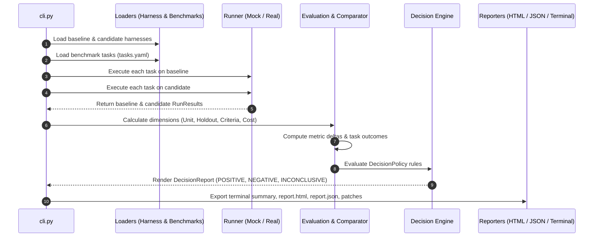

# Source Code Architecture (`src/harness_eval`)

The `src/` directory contains the core implementation of the `harness-eval` evaluation and comparison package.

---

## 1. Directory Structure

```text
src/
└── harness_eval/
    ├── __init__.py           # Package version definition (v0.1.0)
    ├── __main__.py           # python -m harness_eval entrypoint
    ├── cli.py                # Command-line interface parser and dispatcher
    ├── config.py             # DecisionPolicy thresholds and configuration
    ├── models.py             # Versioned Pydantic schemas (SCHEMA_VERSION = "1.0.0")
    ├── benchmarks/
    │   └── loader.py         # YAML benchmark suite parser and task filter
    ├── harness/
    │   ├── loader.py         # Harness directory and config.yaml loader
    │   └── diff.py           # Harness structural delta comparator
    ├── runners/
    │   ├── base.py           # AgentRunner abstract base class
    │   ├── mock_runner.py    # Seeded, deterministic mock execution runner
    │   └── real_runner.py    # Subprocess / environment real agent runner
    ├── evaluation/
    │   ├── dimensions.py     # Multi-dimensional scoring functions
    │   ├── comparator.py     # Single-task and aggregate delta comparator
    │   ├── statistics.py     # Repetition variance and small-sample analysis
    │   └── decision.py       # Rule-based decision engine (POSITIVE / NEGATIVE / INCONCLUSIVE)
    └── reporting/
        ├── terminal.py       # Rich ASCII-safe terminal output renderer
        ├── json_reporter.py  # Structured JSON artifact and patch writer
        └── html_reporter.py  # Standalone interactive Jinja2 HTML report generator
```

---

## 2. Module Responsibilities & Core Invariants

### 1. `models.py` — Versioned Data Contracts
- Defines all Pydantic v2 schemas: `ComparisonReport`, `RunResult`, `TaskComparison`, `HarnessConfig`, `HarnessDiff`, `BenchmarkTask`, `DecisionReport`.
- Current schema version: `SCHEMA_VERSION = "1.0.0"`.
- **Critical Invariant**: Schema compatibility must not be broken without bumping `SCHEMA_VERSION`.
- `TestSuiteResult` includes `__test__ = False` to prevent pytest collection collisions.

### 2. `cli.py` & `config.py` — Entrypoints & Policies
- `cli.py` wires the CLI commands: `evaluate`, `inspect`, and `diff`.
- `config.py` defines quantitative thresholds in `DecisionPolicy`:
  - `min_correctness_delta`: `0.08` (+8 percentage points required for POSITIVE).
  - `max_tolerated_regressions`: `0` (Zero regressions tolerated).
  - `max_cost_increase_pct`: `60.0` (Max 60% cost increase tolerated).
  - `min_sample_size_for_certainty`: `10` (Minimum $N=10$ benchmark tasks).

### 3. `runners/` — Pluggable Agent Execution
- [`AgentRunner`](file:///d:/Task/chat/src/harness_eval/runners/base.py): Abstract base class with `run(task, harness, project_dir, iteration, seed) -> RunResult`.
- [`MockRunner`](file:///d:/Task/chat/src/harness_eval/runners/mock_runner.py): Deterministic, MD5-seeded offline runner generating realistic patches, pytest logs, holdout test execution, and token counters.
- [`RealAgentRunner`](file:///d:/Task/chat/src/harness_eval/runners/real_runner.py): Subprocess execution runner invoking `AGENT_RUNNER_CMD` with strict timeouts and error isolation.

### 4. `evaluation/` — Multi-Dimensional Scoring & Decisions
- [`dimensions.py`](file:///d:/Task/chat/src/harness_eval/evaluation/dimensions.py): Computes correctness (40% unit + 60% holdout), requirement satisfaction (weighted criteria), and convention compliance (lint deductions).
- [`comparator.py`](file:///d:/Task/chat/src/harness_eval/evaluation/comparator.py): Calculates absolute and relative metric deltas between baseline and candidate runs.
- [`statistics.py`](file:///d:/Task/chat/src/harness_eval/evaluation/statistics.py): Computes pass rate distributions, runtime/cost medians, means, and variance across repeated runs (`--repetitions`).
- [`decision.py`](file:///d:/Task/chat/src/harness_eval/evaluation/decision.py): Policy enforcement engine rendering defensible verdicts (`POSITIVE`, `NEGATIVE`, or `INCONCLUSIVE`).

### 5. `reporting/` — Multi-Format Exporters
- [`terminal.py`](file:///d:/Task/chat/src/harness_eval/reporting/terminal.py): ASCII-safe terminal output using `rich` tables and banners to avoid Windows encoding issues.
- [`json_reporter.py`](file:///d:/Task/chat/src/harness_eval/reporting/json_reporter.py): Writes `report.json`, compact `summary.json`, and raw task patch diffs (`runs/<task_id>/*.patch`).
- [`html_reporter.py`](file:///d:/Task/chat/src/harness_eval/reporting/html_reporter.py): Standalone, responsive dark-mode HTML report using Jinja2 with collapsible accordions and zero external CDN dependencies.

---

## 3. High-Level Execution Flow



---

## 4. Extending `harness-eval`

### Adding a Custom Agent Runner
To integrate a custom agent framework (e.g., LangChain, AutoGen, Claude Code CLI):

```python
from harness_eval.runners.base import AgentRunner
from harness_eval.models import RunResult, BenchmarkTask, HarnessConfig
from pathlib import Path
from typing import Optional

class CustomAgentRunner(AgentRunner):
    def run(
        self,
        task: BenchmarkTask,
        harness: HarnessConfig,
        project_dir: Path,
        iteration: int = 1,
        seed: Optional[int] = None,
    ) -> RunResult:
        # 1. Prepare agent prompt from task.description and harness instructions
        # 2. Invoke external agent CLI or API
        # 3. Capture generated diff and execute tests in project_dir
        # 4. Return populated RunResult instance
        ...
```

For full architectural details, consult the comprehensive [Technical Documentation](file:///d:/Task/chat/docs/Project_Documentation.md).
